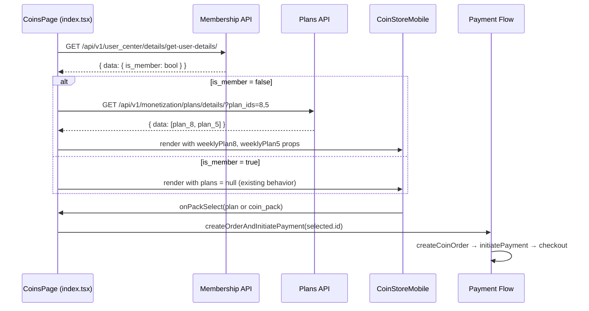
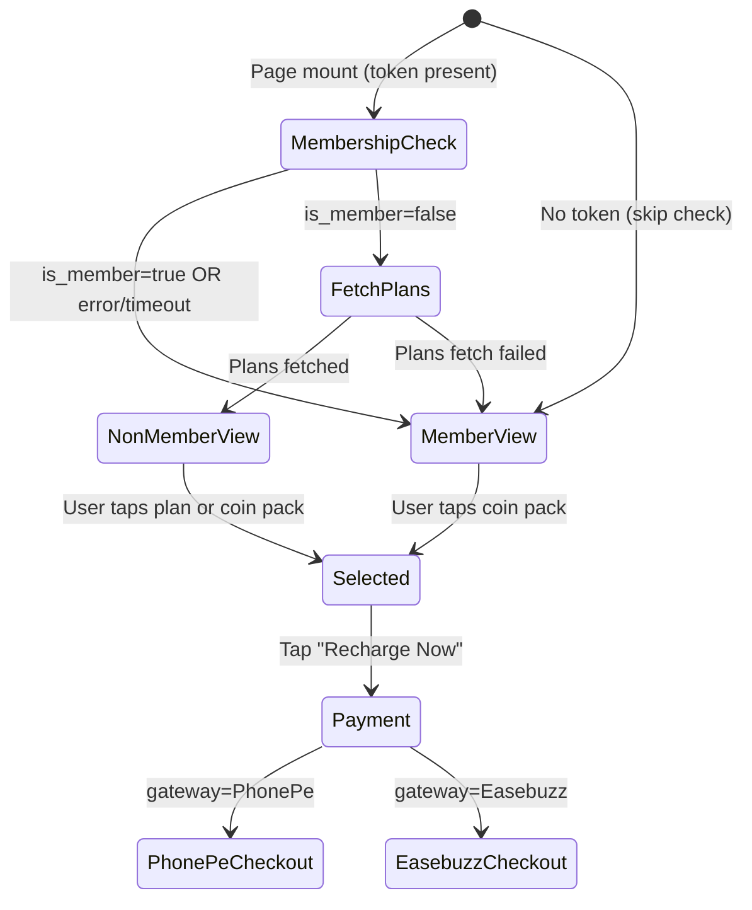

# Design Document: Membership-Aware Coin Store

## Overview

This design adds membership-aware logic to the coin store page so that non-members see subscription plans (Weekly Plans) alongside the existing coin packs, while members continue to see the unmodified coin pack experience.

The approach:
1. On page mount, the `CoinsPage` component in `index.tsx` fetches the user's membership status from the User Details API.
2. If `is_member` is `false`, it fetches subscription plan details from the Plans API.
3. The fetched plan data is mapped to new props passed to `CoinStoreMobile`, which renders new plan card components in the appropriate slots.
4. Selection state is unified — selecting a plan deselects any coin pack and vice versa.
5. The existing `createOrderAndInitiatePayment` flow handles plan purchases by passing the plan's `id` as the `coin_pack_id` parameter.

**Key design decision:** Rather than creating a separate subscription purchase flow, we reuse the existing order/payment pipeline since the backend accepts plan IDs in the same `coin_pack_id` field. This minimizes new code and keeps the payment experience consistent.

## Architecture



### Component Hierarchy

```
CoinsPage (index.tsx)
├── Loading Indicator (while membership check in progress)
├── CoinStoreMobile
│   ├── WeeklyPlanLimitedOfferCard (plan_id=8, non-members only)
│   ├── WeeklyPlanCard (plan_id=5, non-members only, new section)
│   ├── ExclusiveDealCard[] (coin packs, always shown)
│   └── TopPlanCard[] (coin packs, always shown)
└── Fixed Bottom Bar ("Recharge Now" button)
```

## Components and Interfaces

### New API Call: `fetchMembershipStatus`

Added to `CoinsPage` in `index.tsx` (not a separate utility file — keeps the data-fetching colocated with the component that uses it).

```typescript
type MembershipStatusResult = {
  isMember: boolean;
};

async function fetchMembershipStatus(
  token: string,
  organisationId: string,
  signal?: AbortSignal
): Promise<MembershipStatusResult> {
  const jwtToken = headerSafeToken(token);
  const response = await fetch(
    `${HOST}/api/v1/user_center/details/get-user-details/`,
    {
      method: "GET",
      headers: {
        "Content-Type": "application/json",
        ...(jwtToken ? { Authorization: `Bearer ${jwtToken}` } : {}),
        "X-Organisation-ID": organisationId,
      },
      signal,
    }
  );
  if (!response.ok) throw new Error(`HTTP ${response.status}`);
  const json = await response.json();
  return { isMember: Boolean(json?.data?.is_member) };
}
```

### New API Call: `fetchSubscriptionPlans`

Also added inline in `index.tsx`:

```typescript
type SubscriptionPlan = {
  id: number;
  plan_name: string;
  price: number;
  plan_duration: number;
};

async function fetchSubscriptionPlans(
  token: string,
  organisationId: string,
  signal?: AbortSignal
): Promise<{ plan8: SubscriptionPlan | null; plan5: SubscriptionPlan | null }> {
  const jwtToken = headerSafeToken(token);
  const response = await fetch(
    `${HOST}/api/v1/monetization/plans/details/?plan_ids=8,5`,
    {
      method: "GET",
      headers: {
        "Content-Type": "application/json",
        ...(jwtToken ? { Authorization: `Bearer ${jwtToken}` } : {}),
        "X-Organisation-ID": organisationId,
      },
      signal,
    }
  );
  if (!response.ok) throw new Error(`HTTP ${response.status}`);
  const json = await response.json();
  const plans: any[] = json?.data ?? [];
  const plan8 = plans.find((p: any) => p.id === 8) ?? null;
  const plan5 = plans.find((p: any) => p.id === 5) ?? null;
  return { plan8, plan5 };
}
```

### Updated `CoinStoreMobile` Props

```typescript
type CoinStoreMobileProps = {
  // Existing props (unchanged)
  timerPack: CoinStorePack | null;
  exclusiveDeals: CoinStorePack[];
  topPlans: CoinStorePack[];
  selectedPackageId: number | null;
  onPackSelect: (pkg: CoinStorePack, index: number) => void;
  onRecharge: () => void;

  // New props for non-member display
  weeklyPlan8: SubscriptionPlan | null;  // Shown in Limited Offer slot (no timer)
  weeklyPlan5: SubscriptionPlan | null;  // Shown in new "Weekly Plans" section
  isMember: boolean;                      // Controls which UI path to render
};
```

### New Component: `WeeklyPlanLimitedOfferCard`

Renders plan_id=8 in the Limited Offer visual slot (same gradient background as `LimitedOfferCard`) but without the countdown timer.

```typescript
function WeeklyPlanLimitedOfferCard({
  plan,
  selected,
  onSelect,
}: {
  plan: SubscriptionPlan;
  selected: boolean;
  onSelect: () => void;
}) {
  return (
    <button
      type="button"
      onClick={onSelect}
      className={`relative w-full overflow-hidden rounded-[20px] text-left transition-transform active:scale-[0.99] ${
        selected ? "ring-2 ring-white/80 ring-offset-2 ring-offset-[#000D26]" : ""
      }`}
    >
      <div className="relative bg-gradient-to-r from-[#FF5A3C] via-[#FF4D5E] to-[#FF7A52] px-4 pb-4 pt-4">
        {/* Sparkle decorations (same as LimitedOfferCard) */}
        <div className="relative z-[1] pr-12">
          <p className="text-[13px] font-semibold tracking-wide text-white">
            Limited offer
          </p>
        </div>
        <div className="relative z-[1] mt-4 flex items-center justify-between rounded-2xl bg-[#00000033] px-4 py-3.5">
          <div className="flex min-w-0 flex-col gap-0.5">
            <span className="text-lg font-bold text-white">{plan.plan_name}</span>
            <span className="text-xs text-white/70">
              {plan.plan_duration === 7 ? "Weekly" : `${plan.plan_duration} days`}
            </span>
          </div>
          <span className="shrink-0 pl-2 text-xl font-bold text-white">
            ₹ {plan.price}
          </span>
        </div>
      </div>
    </button>
  );
}
```

### New Component: `WeeklyPlanCard`

Renders plan_id=5 in a new "Weekly Plans" section between Limited Offer and Exclusive Deals.

```typescript
function WeeklyPlanCard({
  plan,
  selected,
  onSelect,
}: {
  plan: SubscriptionPlan;
  selected: boolean;
  onSelect: () => void;
}) {
  return (
    <button
      type="button"
      onClick={onSelect}
      className={`flex w-full items-center justify-between rounded-2xl bg-[#0f1f3d] px-4 py-4 text-left transition-all active:scale-[0.99] ${
        selected ? "ring-2 ring-[#3B82F6]/80" : "ring-1 ring-white/5"
      }`}
    >
      <div className="flex flex-col gap-0.5">
        <span className="text-lg font-bold text-white">{plan.plan_name}</span>
        <span className="text-xs text-white/60">
          {plan.plan_duration === 7 ? "Weekly" : `${plan.plan_duration} days`}
        </span>
      </div>
      <span className="text-base font-semibold text-white">
        ₹ {plan.price}
      </span>
    </button>
  );
}
```

### Updated `CoinStoreMobile` Render Logic

```typescript
export const CoinStoreMobile = ({
  timerPack,
  exclusiveDeals,
  topPlans,
  selectedPackageId,
  onPackSelect,
  onRecharge,
  weeklyPlan8,
  weeklyPlan5,
  isMember,
}: CoinStoreMobileProps) => {
  // ... existing indexedPacks logic ...

  return (
    <div className="flex flex-col bg-[#000D26] md:hidden">
      <main className="space-y-6 px-4 pt-4 pb-32">
        
        {/* Limited Offer slot */}
        {isMember && timerPack && (
          <LimitedOfferCard ... />  {/* existing timer-based card */}
        )}
        {!isMember && weeklyPlan8 && (
          <WeeklyPlanLimitedOfferCard
            plan={weeklyPlan8}
            selected={selectedPackageId === weeklyPlan8.id}
            onSelect={() => onPackSelect(
              { id: weeklyPlan8.id, coins: 0, price: weeklyPlan8.price },
              0
            )}
          />
        )}

        {/* Weekly Plans section (non-members only) */}
        {!isMember && weeklyPlan5 && (
          <section>
            <h2 className="mb-3 text-base font-bold text-white">Weekly Plans</h2>
            <WeeklyPlanCard
              plan={weeklyPlan5}
              selected={selectedPackageId === weeklyPlan5.id}
              onSelect={() => onPackSelect(
                { id: weeklyPlan5.id, coins: 0, price: weeklyPlan5.price },
                1
              )}
            />
          </section>
        )}

        {/* Exclusive Deals (always shown) */}
        {exclusiveDeals.length > 0 && ( ... )}

        {/* Top Plans (always shown) */}
        {topPlans.length > 0 && ( ... )}
      </main>

      {/* Fixed bottom bar with Recharge Now button */}
      ...
    </div>
  );
};
```

### Updated `CoinsPage` Logic in `index.tsx`

```typescript
const CoinsPage = ({ ... }) => {
  // --- New state ---
  const [membershipLoading, setMembershipLoading] = useState(true);
  const [isMember, setIsMember] = useState(true); // default to member (safe fallback)
  const [weeklyPlan8, setWeeklyPlan8] = useState<SubscriptionPlan | null>(null);
  const [weeklyPlan5, setWeeklyPlan5] = useState<SubscriptionPlan | null>(null);

  // --- Membership check on mount ---
  useEffect(() => {
    if (!token) {
      // No JWT → treat as member, skip API call
      setMembershipLoading(false);
      return;
    }

    const controller = new AbortController();
    const timeout = setTimeout(() => controller.abort(), 10000);

    fetchMembershipStatus(token, organisationId, controller.signal)
      .then(({ isMember: memberStatus }) => {
        setIsMember(memberStatus);
        if (!memberStatus) {
          // Fetch plans for non-members
          return fetchSubscriptionPlans(token, organisationId)
            .then(({ plan8, plan5 }) => {
              setWeeklyPlan8(plan8);
              setWeeklyPlan5(plan5);
            })
            .catch(() => {
              // Plans fetch failed → fall back to coin pack display
              setIsMember(true);
            });
        }
      })
      .catch(() => {
        // Membership check failed → treat as member
        setIsMember(true);
      })
      .finally(() => {
        clearTimeout(timeout);
        setMembershipLoading(false);
      });

    return () => {
      controller.abort();
      clearTimeout(timeout);
    };
  }, [token, organisationId]);

  // --- Full-page loading while membership resolves ---
  if (membershipLoading) {
    return (
      <div className="flex min-h-screen items-center justify-center bg-[#000D26]">
        <div className="flex items-center gap-2 text-sm text-white/60">
          <i className="fa-solid fa-spinner fa-spin" aria-hidden />
          Loading…
        </div>
      </div>
    );
  }

  // --- Existing coin pack logic (unchanged) ---
  // ...

  return (
    <CoinStoreMobile
      timerPack={timerPack}
      exclusiveDeals={exclusiveDeals}
      topPlans={topPlans}
      selectedPackageId={selectedPackage?.id ?? null}
      onPackSelect={handlePackSelect}
      onRecharge={handleMobileRecharge}
      weeklyPlan8={weeklyPlan8}
      weeklyPlan5={weeklyPlan5}
      isMember={isMember}
    />
  );
};
```

## Data Models

### Plans API Response Shape

```typescript
// GET ${HOST}/api/v1/monetization/plans/details/?plan_ids=8,5
// Response:
{
  success: true,
  data: [
    {
      id: 8,
      plan_name: "Weekly Premium",
      price: 49,           // number (INR)
      plan_duration: 7,    // days
      is_active: true,
      // ... other fields we don't need for display
    },
    {
      id: 5,
      plan_name: "Weekly Basic",
      price: 29,
      plan_duration: 7,
      is_active: true,
    }
  ]
}
```

### Membership API Response Shape

```typescript
// GET ${HOST}/api/v1/user_center/details/get-user-details/
// Response:
{
  success: true,
  data: {
    is_member: boolean,
    // ... other user fields (not used here)
  }
}
```

### Unified Selection Model

The `selectedPackage` state in `CoinsPage` holds either a coin pack object OR a plan object mapped to the same shape:

```typescript
// For coin packs (existing):
{ id: 42, coins: 100, price: 99, bonus_coins: 10, product_id: "coin_100", ... }

// For subscription plans (new — mapped on selection):
{ id: 8, coins: 0, price: 49, name: "Weekly Premium" }
```

When a plan is selected and the user taps "Recharge Now", `handlePayClick` calls `createOrderAndInitiatePayment(selectedPackage.id, ...)` — the backend interprets this `id` as either a coin_pack_id or plan_id in the same endpoint.

### State Flow Diagram




## Correctness Properties

*A property is a characteristic or behavior that should hold true across all valid executions of a system — essentially, a formal statement about what the system should do. Properties serve as the bridge between human-readable specifications and machine-verifiable correctness guarantees.*

### Property 1: Member view renders all provided coin packs

*For any* valid arrays of `CoinStorePack` objects (timerPack, exclusiveDeals, topPlans) and `isMember=true`, the rendered output SHALL contain one card per pack — the timerPack in a LimitedOfferCard with countdown timer, each exclusive deal in an ExclusiveDealCard showing coins/price/bonus, and each top plan in a TopPlanCard showing coins/price.

**Validates: Requirements 2.1, 2.2, 2.3**

### Property 2: Subscription plan UI absent for members

*For any* configuration where `isMember=true`, the rendered CoinStoreMobile SHALL NOT contain any WeeklyPlanLimitedOfferCard, WeeklyPlanCard, or "Weekly Plans" section heading, regardless of whether `weeklyPlan8` or `weeklyPlan5` props are provided.

**Validates: Requirements 2.4, 5.2**

### Property 3: Non-member Limited Offer shows plan without timer

*For any* valid `SubscriptionPlan` passed as `weeklyPlan8` with `isMember=false`, the rendered Limited Offer slot SHALL display the plan's name and price, use the same gradient background as the timer card, and SHALL NOT contain any countdown timer element, stopwatch icon, or time-related display.

**Validates: Requirements 4.1, 4.3**

### Property 4: Plan card displays name, formatted price, and billing period

*For any* valid `SubscriptionPlan` with a numeric `price` and `plan_duration`, the rendered plan card (either WeeklyPlanLimitedOfferCard or WeeklyPlanCard) SHALL display the `plan_name` text, the price formatted as "₹ {amount}", and a human-readable billing period derived from `plan_duration` (e.g., "Weekly" for 7 days).

**Validates: Requirements 4.2, 5.3**

### Property 5: Selection mutual exclusion

*For any* set of selectable items (coin packs and subscription plans) rendered in CoinStoreMobile, selecting any single item SHALL result in exactly that item having the visual selection indicator (ring highlight), all other items having no selection indicator, and the "Recharge Now" button being enabled.

**Validates: Requirements 2.5, 4.5, 5.4, 5.5, 7.4**

### Property 6: Non-member layout order

*For any* non-member view where both `weeklyPlan8`, `weeklyPlan5`, `exclusiveDeals`, and `topPlans` are provided, the DOM order of sections from top to bottom SHALL be: Limited Offer (plan 8) → Weekly Plans (plan 5) → Exclusive Deals (coin packs) → Top Plans (coin packs).

**Validates: Requirements 5.1, 7.3**

### Property 7: Coin pack sections render regardless of membership status

*For any* valid arrays of `exclusiveDeals` and `topPlans` coin packs, the Exclusive Deals and Top Plans sections SHALL render with all provided packs regardless of whether `isMember` is `true` or `false`.

**Validates: Requirements 7.1, 7.2**

## Error Handling

| Scenario | Behavior | Fallback |
|----------|----------|----------|
| Missing/empty `id` URL param (no JWT) | Skip membership API call | Show member view (coin packs only) |
| Membership API returns non-2xx | Catch error, set `isMember=true` | Show member view |
| Membership API network timeout (10s) | AbortController aborts request | Show member view |
| Membership API response missing `data.is_member` | `Boolean(undefined)` → `false`, but parse safely | Treated as non-member — Plans API will be called |
| Plans API returns non-2xx | Catch error, set `isMember=true` override | Show member view (full fallback) |
| Plans API timeout (10s) | AbortController aborts request | Show member view |
| Plans API returns only one plan | Display available plan, omit missing one | No error shown |
| Plans API returns empty array | No plans to display | Show member view (isMember override to true) |
| Payment order creation fails | Existing error handling in `createOrderAndInitiatePayment` | Console error, no UI change |
| Payment initiation fails | Existing error handling | Console error, no UI change |
| Checkout iframe fails to open | Existing `pollCoinPackPaymentAfterCheckout` fallback | Poll for status anyway |

### Abort Controller Pattern

Both API calls use `AbortController` with a 10-second timeout to ensure the loading state never hangs:

```typescript
const controller = new AbortController();
const timeout = setTimeout(() => controller.abort(), 10000);
// ... fetch with { signal: controller.signal }
// Cleanup in .finally() and useEffect return
```

### Graceful Degradation Principle

The feature is designed so that any failure in the new membership/plans logic falls back to the existing coin pack experience. Users are never blocked from purchasing — they may just not see subscription plans if something goes wrong.

## Testing Strategy

### Unit Tests (Example-Based)

| Test Case | What it verifies |
|-----------|------------------|
| Mount with no token → no API call, member view shown | Requirement 1.3 |
| Membership API returns `is_member: true` → member view | Requirement 1.2 |
| Membership API returns `is_member: false` → Plans API called | Requirement 3.1 |
| Membership API error → fallback to member view | Requirement 1.4 |
| Membership API timeout → fallback to member view | Requirement 1.4 |
| Plans API returns both plans → both extracted | Requirement 3.2 |
| Plans API returns only plan 8 → only plan 8 shown | Requirement 3.3 |
| Plans API error → fallback to member view | Requirement 3.4 |
| Loading indicator shown during membership check | Requirement 1.5 |
| Recharge Now with plan selected → correct id passed | Requirement 6.1 |

### Property-Based Tests

Property-based testing is appropriate here because the component rendering logic varies meaningfully with input data (different pack configurations, plan data, and selection states). The `CoinStoreMobile` component is a pure presentational component — given props, it produces deterministic output.

**Library:** [fast-check](https://github.com/dubzzz/fast-check) (already compatible with the Vite + TypeScript setup)

**Configuration:** Minimum 100 iterations per property test.

| Property Test | Validates | Generators |
|--------------|-----------|------------|
| Property 1: Member view renders all coin packs | Req 2.1-2.3 | Random CoinStorePack arrays (1-10 items, random coins/price/bonus) |
| Property 2: No subscription UI for members | Req 2.4, 5.2 | Random plan data + isMember=true |
| Property 3: Non-member Limited Offer without timer | Req 4.1, 4.3 | Random SubscriptionPlan with varying name/price |
| Property 4: Plan card shows name/price/period | Req 4.2, 5.3 | Random plan_name (string), price (positive number), plan_duration (1-365) |
| Property 5: Selection mutual exclusion | Req 2.5, 4.5, 5.4, 5.5, 7.4 | Random list of N items, random selection index pairs |
| Property 6: Non-member layout order | Req 5.1, 7.3 | Random plans + packs, verify DOM section order |
| Property 7: Coin packs render for both membership states | Req 7.1, 7.2 | Random CoinStorePack arrays × { true, false } membership |

**Tag format:** Each test tagged with `Feature: membership-aware-coin-store, Property {N}: {description}`

### Integration Tests

| Test Case | What it verifies |
|-----------|------------------|
| Full flow: non-member → plan selected → Recharge Now → order created with plan id | Requirement 6.1-6.2 |
| PhonePe checkout launched for plan purchase | Requirement 6.3 |
| Easebuzz checkout launched for plan purchase | Requirement 6.4 |
| Payment polling after checkout completion | Requirement 6.5 |
